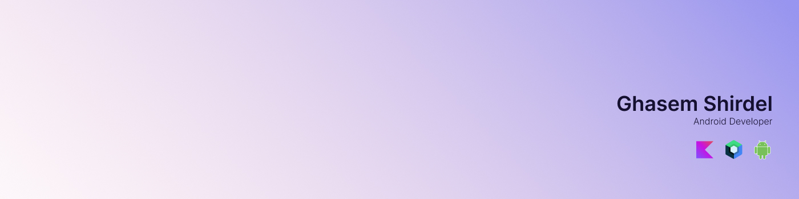

# Hi! 😃

My name is Ghasem, a Native Android Developer with Kotlin.

## 📃 About Me

My experience as an Android developer spans more than three years, and I started programming in my second year of university. I have worked as a freelancer with startups in Mashhad and Bojnord on a part-time basis. For me, learning more and group activities are more challenging. I enjoy complex projects because they provide me with lots of learning opportunities.

Additionally, I graduated from Bojnurd University with a Bachelor's degree in computer engineering and have experience meeting hardworking people, becoming to TA in advanced programming lectures, and creating a startup.  

My weekend schedule consists of spending time with family and friends. Occasionally, I paint and listen to music. When I'm not coding, I like to watch comic books and anime shows or read novels book.

### ⚒️ Tech Stack

&nbsp;
&nbsp;
&nbsp;
&nbsp;
&nbsp;
&nbsp;
&nbsp;
&nbsp;
&nbsp;
)&nbsp;
&nbsp;
&nbsp;
&nbsp;
&nbsp;
&nbsp;
&nbsp;
&nbsp;

### ⏱️ Wakatime

### ⚙️ GitHub Analytics

### 📫 Connect with Me

